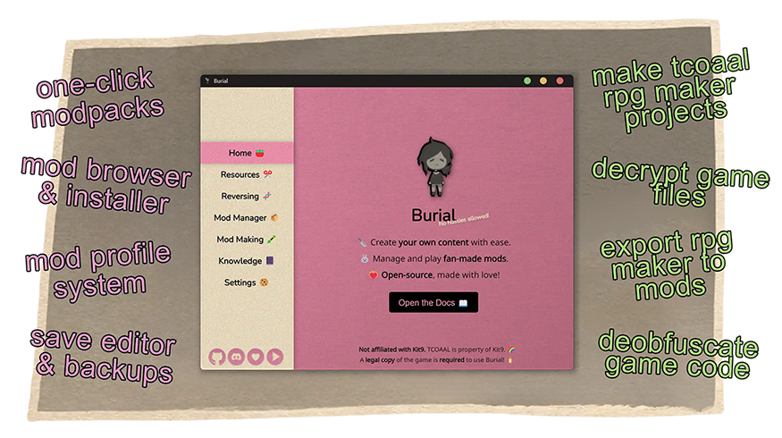

<!-- Header + Navigation -->

    

# Burial 
A (pretty) one-stop-shop for [The Coffin of Andy and Leyley](https://store.steampowered.com/app/2378900/The_Coffin_of_Andy_and_Leyley/) modding 💚🩷
 

[Features 🐰](#features-) • [Download & Install 🩸](#installing-burial-) • [Documentation 🥩](#documentation-) • [Roadmap 👁️](#roadmap-%EF%B8%8F)

[Contribute 🥰](https://github.com/kleineluka/burial/wiki/Contributing) • [Credits 🎉](https://github.com/kleineluka/burial/blob/main/ATTRIBUTIONS.md) • [Website 🔪](https://www.luka.moe/burial) • [Changelog 🍅](https://github.com/kleineluka/burial/wiki/Changelog) • [Discord 🥰](https://www.discord.gg/WWxAjJMspk)

<!-- Preview -->

<!-- Features -->
# Features 🐰
Burial is a program for TCOAAL mod players, mod creators, or just about anybody who likes the game~ 🍅

- **Mod Manager** 🍱: One-click install of modpacks, modloader manager, browse/download mods (from various sources), manage installed mods, install mods from external URLs, one-click mod installation from websites (burial:// protocol), switch mods easily with a profile system, and preview upcoming mods.
- **Resources** ✂️: Decrypt/encrypt .k9a files, export categories of resources, generate asset templates, parse/import dialogue, and decrypt/modify save files.
- **Reversing** 🧬: Targeted code injection, export/deobfuscate/comment game run-time code, manage NW.js SDK's, manage developer tools, view game information, and create backups of your game files.
- **Mod Tools** 🖍️:  Turn the game to an RPG Maker project, export an RPG Maker project to a mod, convert a non-Tomb mod to a Tomb mod, decompile a mod, edit mod.json files, edit repo.json files, and generate mod version differences.
- **Knowledge** 📔: Easily access modding resources in one convenient place.
- **Easy and Safe** 🍵: Burial only takes a few clicks to get you playing mods, has lots of tooltips, and implements safety guardrails to protect your saves.
- **Quality of Life** 🌸: Pretty GUI with character-based themes, settings, built-in tutorials, update checking, lots of emojis..
- **Fast, Small, and Open** 🦄: Built with Rust, a native webview (<30mb, no Electron!), and a forever open-source mindset.

<!-- Install (Burial) -->
# Installing Burial 🩸
**Burial is stable on Windows, but Linux and Mac builds are experimental!**
1. **Download** the latest app from [Github Releases](https://github.com/kleineluka/burial/releases), GameBanana, Itch.io, or Nexus Mods.
2. **Run** the installer, silly!
     
    Questions: [Why does Windows Defender appear?](https://github.com/kleineluka/burial/wiki/Problems-and-Questions#question-why-does-windows-defender-or-whatever-antivirus-im-using-flag-burial) and [Why is the program not portable?](https://github.com/kleineluka/burial/wiki/Problems-and-Questions#question-why-isnt-burial-portable-ex-an-exe-w-no-installer)
3. **Open** the program and **enjoy**!

To compile the source code yourself, please see the [Contributing page](https://github.com/kleineluka/burial/wiki/Contributing) on the Wiki.

<!-- Install (Mods) -->
# Installing Mods 🔪

Burial has dedicated sections for installing mods and Tomb (modloader), or you can do everything in one-click in the modpacks section. Mod metadata is fetched from [Llamawa.re](https://llamawa.re/mods/), [Burial's curated list](https://github.com/kleineluka/burial/blob/main/api/foreign.json), and [Peachy's Visions](https://peachy.codeberg.page/visions). Burial also supports downloading mods from URLs, including GameBanana, Github, and direct links. 

**Burial is not associated with any mods and is simply a mod manager. Please only download mods that you trust. Burial does not host or distribute any mods and will only add mods when they can be downloaded from their official source.**

Further reading: [Submit my mod to Burial](https://github.com/kleineluka/burial/wiki/Adding-Mods-&-Packs#i-want-to-submit-a-mod-i-made), [submit somebody else's mod to Burial](https://github.com/kleineluka/burial/wiki/Adding-Mods-&-Packs#i-want-to-submit-somebody-elses-mod), and [submitting a modpack to Burial](https://github.com/kleineluka/burial/wiki/Adding-Mods-&-Packs#i-want-to-submit-a-modpack). If you are having trouble with a third-party mod, please see [why doesn't Burial support this or that mod?](https://github.com/kleineluka/burial/wiki/Problems-and-Questions#question-why-does-burial-not-support-this-or-that-mod)

<!-- Documentation -->
# Documentation 🥩
Please view the [Wiki](https://github.com/kleineluka/burial/wiki)! For help installing, go to the [Installation and Help page](https://github.com/kleineluka/burial/wiki/Installation-and-Help). For further help, check out the [Problems and Questions page](https://github.com/kleineluka/burial/wiki/Problems-and-Questions). And if all else fails? ~~Practice demonic magic with your favourite sibling-~~ Open an [issue on Github](https://github.com/kleineluka/burial/issues) or [contact me!](https://github.com/kleineluka).

The tech stack is a Rust back-end (Tauri framework), a web front-end (minimal dependencies), Python scripts to aid in development, TypeScript (Deno) for code deobfuscation, and Javascript for game modification. Wanna help? Check out the [Contributing page](https://github.com/kleineluka/burial/wiki/Contributing) on the Wiki~

<!-- Roadmap -->
# Roadmap 👁️
(In no particular order and beyond basic planned features, aka luxury things that mostly™ will start after the first release..)
- [ ] Steam Deck Optimization (high priority)
- [ ] Disk Space Awareness (high priority)
- [ ] Language Support (medium priority)
- [ ] Better Dialog Handling (accept copy as path, take zips in place of folders)
- [ ] Easier Save Editor (low priority)
- [ ] Cleanup (Code, UI, Responsiveness, Code Warnings, Var Ownership, Structure, JS -> Rust, Logging, Async I/O)
- [ ] Self Updating (medium priority)
- [ ] One-Click GameBanana Installation (high priority)
- [ ] Symbolic Linking Mod Installations (medium priority)
- [ ] Mod Compatability Checking
- [ ] 7z, TAR Support (switch to 7Zip, low priority)
- [ ] NexusMods, Itch.Io Support (low priority)
- [x] Game Instances (Profiles)
- [x] More Tooltips
- [x] Theming System
- [x] Settings System
- [x] Development Build Scripts
- [x] Linux, MacOS Beta Builds

<!-- Footer -->

**By Fans, Not Thieves 💗** A legal copy of the game is required to use Burial! Burial will **never** implement any piracy tools. 
 
Please read the **[license](https://github.com/kleineluka/burial/blob/main/LICENSE) and [EULA](https://github.com/kleineluka/burial/blob/main/EULA.md)** before interacting with this software, and respect all licenses and rights in attributions. 🤓
 
This is a passion project that I work on constantly in my free-time. If you want to support me, please star 🌠 the repository or contribute!

